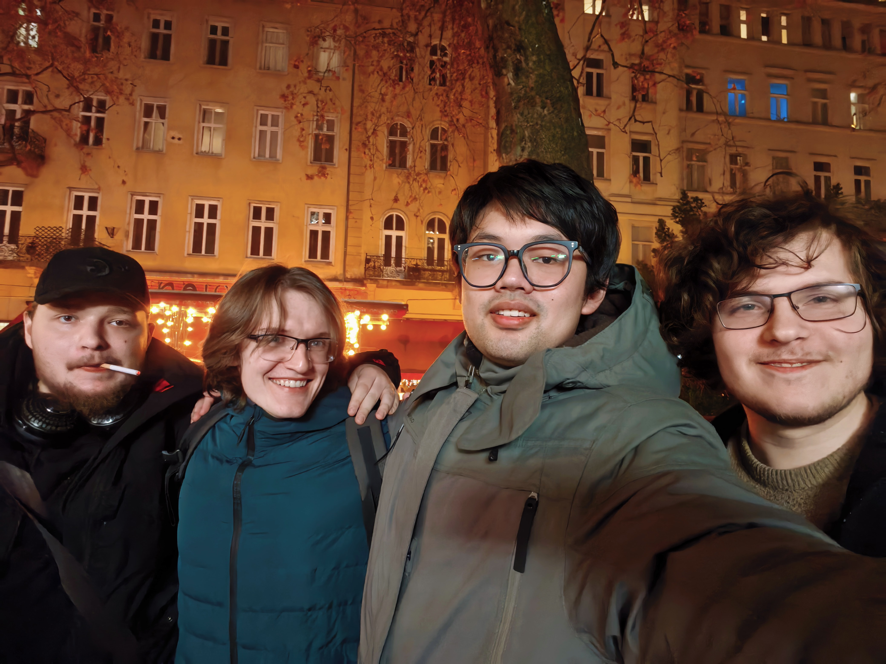

# 个人信息

# 基础信息
- 姓名：廖润康
- 年龄：23
- 专业：计算机科学（Computer Science）
- 毕业院校：匈牙利罗兰大学
- 毕业设计题目：《基于质数哈希键和质因数分解查询的关系型数据库》
- 邮箱：`M4n1puLatE@outlook.com`

# 教育经历

| 时间        | 就读院校          | 文凭   | 专业       |
| --------- | ------------- | ---- | -------- |
| 2015-2018 | 南京市人民中学       | 初中   | -        |
| 2018-2021 | 南京大学附属中学国际高中  | 高中   | -        |
| 2021-2023 | 南京航空航天大学SQA项目 | -    | 国际商务会计   |
| 2023-2026 | 匈牙利罗兰大学       | 理科学士 | 计算机科学与技术 |

#  编程能力 
- 熟练使用C++语言，并主要使用C++进行编程。
	- 掌握C++多线程开发，在毕业设计中使用多线程结构完成数据库构建。
- 掌握Java语言
	- 使用spring boot框架整合mybatis构建后端服务。
- 掌握ORACLE数据原理
	- 包括其底层存储单元分类、事务系统执行、记录组织方式等
- 掌握C硬件编程开发
	- 在STM32平台上构建过简单的图像二值化算法和边缘计算算法。
- 掌握Qt界面开发
	- 使用Qt框架实现了简易的数据库Developer界面
- 了解C#语言和Unity基础游戏开发
- 了解PostgreSQL的数据库的部署，关联开发与表结构设计。
- 了解编译器原理基础
	- 在毕业设计中实现了基础SQL编译器。

#  参与活动
- 作为学生代表之一参加了习主席访问匈牙利的欢迎仪式

# 实习经历
- 江苏舆图信息科技有限公司：实习软件工程师
	- 负责地理信息管线参数建模程序的QT界面开发
	- **实习心得**
		- 了解了QT的信号-槽结构，可以使用QT设计较为复杂且可以动态渲染新元素的桌面应用UI。同时也启发了我在毕业设计项目中使用QT框架实现Client-Sever结构软件的客户端界面。
- 南京市测绘勘察研究院股份有限公司：实习软件工程师
	- 负责水文水动力模型的内核开发
	- 负责水文水动力模型的部分后端服务API开发（使用Java spring+mybatis+postgreSQL）
	- 负责系统内部数据抓取组件的开发
	- **实习心得**
		- 了解了现代信息系统如何通过API调用实现网络服务，并且了解了如何使用mybatis工具将数据库映射到Java类并实现功能。
		- 也学习了如何通过动态库使用C++实现Java方法。

# 个人介绍
- 喜欢富有创造力的工作，爱好编程和计算机技术
- 会另辟蹊径，想出别人没有想过的解法和方法
- 喜欢研究操作系统底层、数据库原理、编译器原理等
- 拥有自己的私有服务器，会基于这个服务器做一些研究和服务的搭建
- 希望自己的代码可以为这个世界变得更好贡献一份力量。

# 项目
## 1. [PrimedDB](https://m4n1pulate.github.io/PrimedDB)（进行中）：基于质数哈希键和质因数分解查询的关系型数据库。
## 2. LDST（进行中）：自建数据结构库。